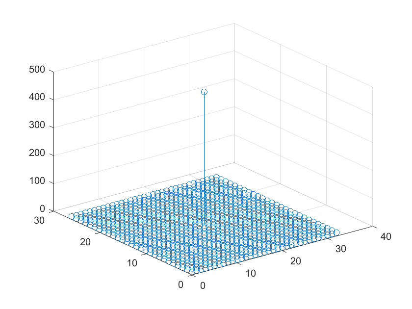

# A genarator for golay matrices
## Usage
  [A, B] = gen_golay_matrices(M, L);
  - Input: 
  (M, L), the size of golay matrices, at least one of M and L must be even.
  - Output: 
  [A, B], two genarated golay matrices, the sum of whose auto-correlation functions is a 2-D delta-function, which is illustrated in a figure:
  
  
